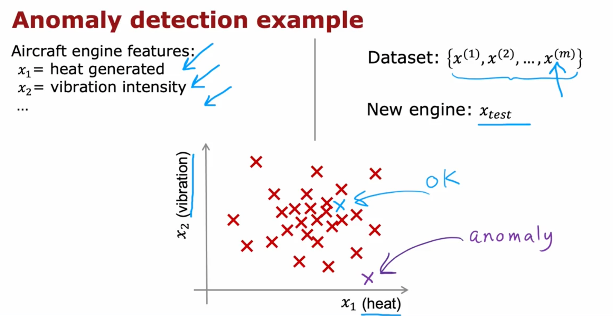
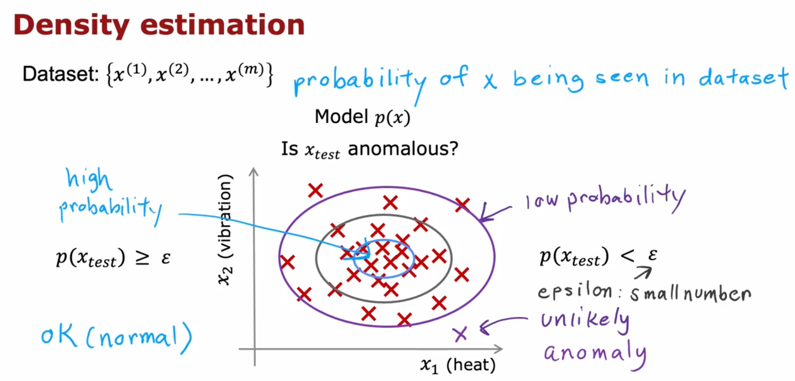

# Finding Unusual Events

Let's explore our second unsupervised learning algorithm: **Anomaly Detection**. This method examines an unlabeled dataset of normal events and learns to detect unusual or anomalous events.

### Aircraft Engine Example
Some of my friends worked on using anomaly detection to identify potential issues in aircraft engines during manufacturing. Given the high stakes involved in aircraft engine reliability, ensuring no faulty engines are shipped is critical.

After manufacturing, different **features** of the aircraft engine are measured:
- $x_1$ = heat generated
- $x_2$ = vibration intensity

To simplify, let's focus on just these two features.

Aircraft manufacturers typically produce very few defective engines. So, we gather a dataset of $m$ normal engines:
\[ \{ x^{(1)}, x^{(2)}, \ldots, x^{(m)} \} \]
Each $x^{(i)}$ represents feature values of a normal engine.

When a new engine $x_{test}$ is produced, we compare its features to this dataset to determine:
- Does $x_{test}$ look like previously manufactured engines (OK)?
- Or is it unusual (anomaly)?

On this plot:
- Red crosses: normal engine data ($x_1$, $x_2$)
- Blue cross: new engine, similar to normal (OK)
- Purple cross: new engine, unusual (anomaly)

### Density Estimation Approach
To automate this, we use **density estimation**:
1. Build a model $p(x)$ from training data.
2. Compute the probability of new data $p(x_{test})$.
3. Compare $p(x_{test})$ to a small threshold $\epsilon$.

- If $p(x_{test}) \geq \epsilon$, engine is normal.
- If $p(x_{test}) < \epsilon$, engine is an anomaly.

- **High probability regions**: inside ellipses.
- **Low probability regions**: outside ellipses.
- New data in high-probability areas: OK.
- New data in low-probability areas: anomaly.

### Applications of Anomaly Detection

#### Fraud Detection:
- $x^{(i)}$ = user activity features (e.g., login frequency, pages visited, transactions, posts, typing speed).
- Model $p(x)$ from historical user data.
- Identify unusual users where $p(x) < \epsilon$.

Security checks may follow:
- Additional verification
- CAPTCHA
- Manual review

#### Manufacturing:
- $x^{(i)}$ = features of product $i$ (e.g., airplane engines, circuit boards, smartphones).
- Inspect products behaving unusually before shipping.

#### Data Center Monitoring:
- $x^{(i)}$ = features of machine $i$:
  - $x_1$ = memory use
  - $x_2$ = disk accesses/sec
  - $x_3$ = CPU load
  - $x_4$ = CPU load/network traffic

Unusual machine behavior may indicate:
- Hardware failure
- Hacking

### Real-World Impact
Anomaly detection is widely used in:
- Fraud detection (e.g., unusual transactions)
- Manufacturing quality control
- Monitoring computer clusters
- Telecom (e.g., detecting faulty cell towers)

I've used it in various domains, including helping telcos ensure better coverage and assisting manufacturers in identifying faulty parts. It's a powerful tool in the machine learning toolkit.

---

In the next module, we'll learn about **Gaussian Distributions**, which help model $p(x)$ for anomaly detection.
