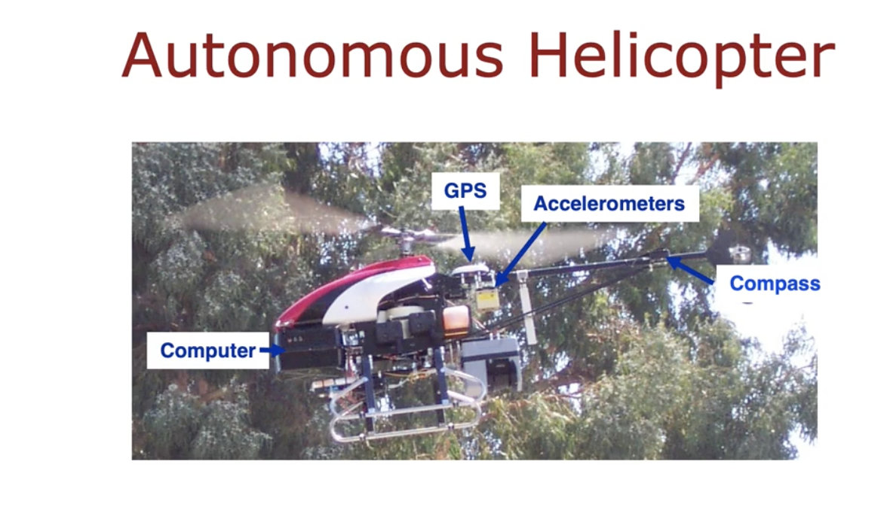
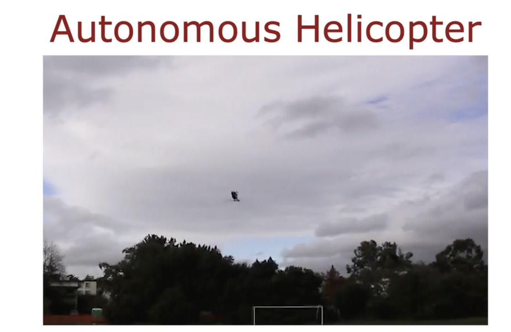
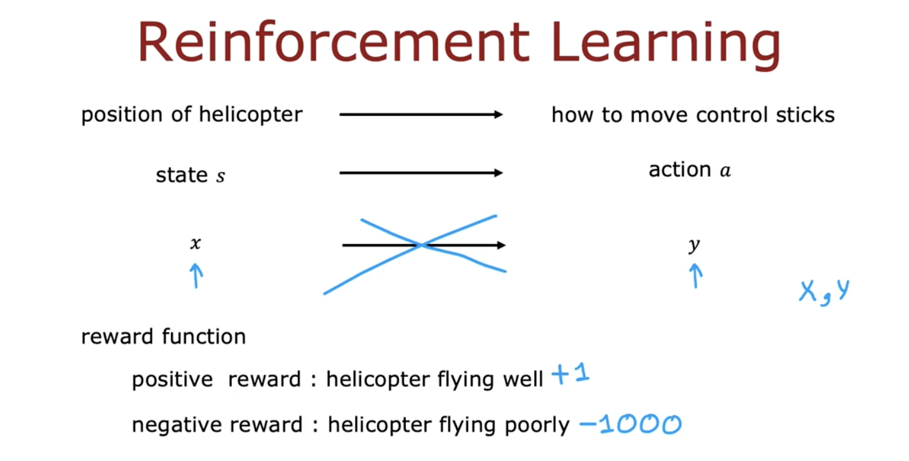
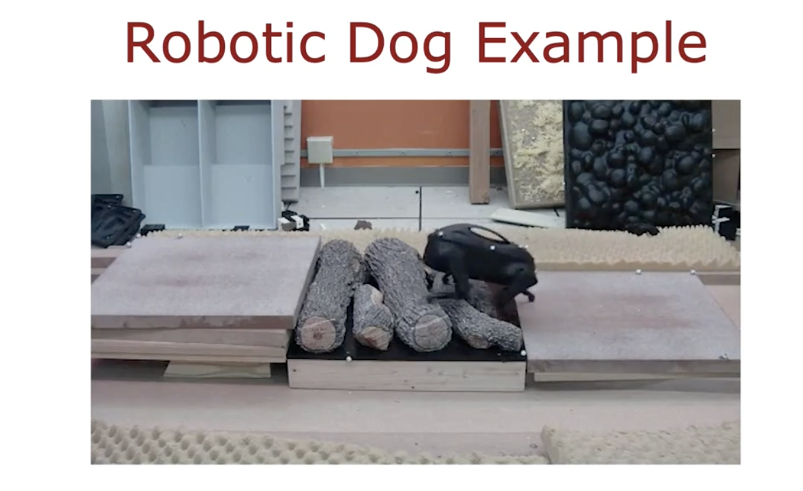
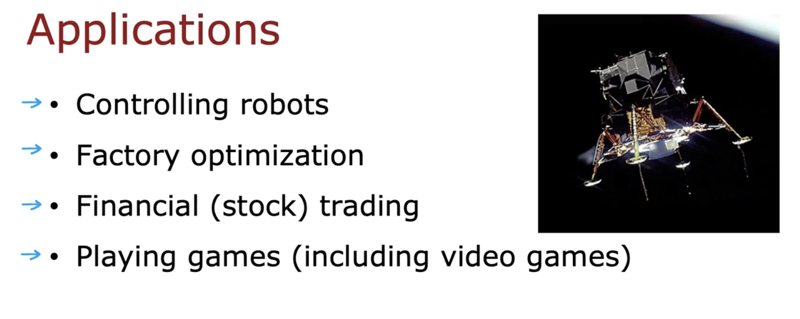

# What is Reinforcement Learning

- **Reinforcement Learning (RL)** is a core pillar of machine learning, with growing research but limited commercial use so far.
- **Autonomous Helicopter Example**:
  - Task: Control a helicopter using RL, mapping states (position, orientation, speed) to actions (joystick movements).
  - Supervised learning isn't ideal due to ambiguity in "correct" actions.
- **Key Concepts**:
  - **State ($s$)**: Current condition of the system.
  - **Action ($a$)**: Control decision taken.
  - **Reward Function**: Indicates performance, e.g., +1 for stable flight, -1000 for crashing.
  - Analogy: Training a dog with "good dog" or "bad dog" feedback.
- **RL Flexibility**: Focus on what to achieve (reward), not how (actions).
- **Robotic Dog Example**: Trained with RL to cross obstacles.
- **Applications**:
  - Robotics, lunar lander simulation.
  - Factory throughput optimization.
  - Financial trading strategies.
  - Game playing: chess, go, video games.

---

