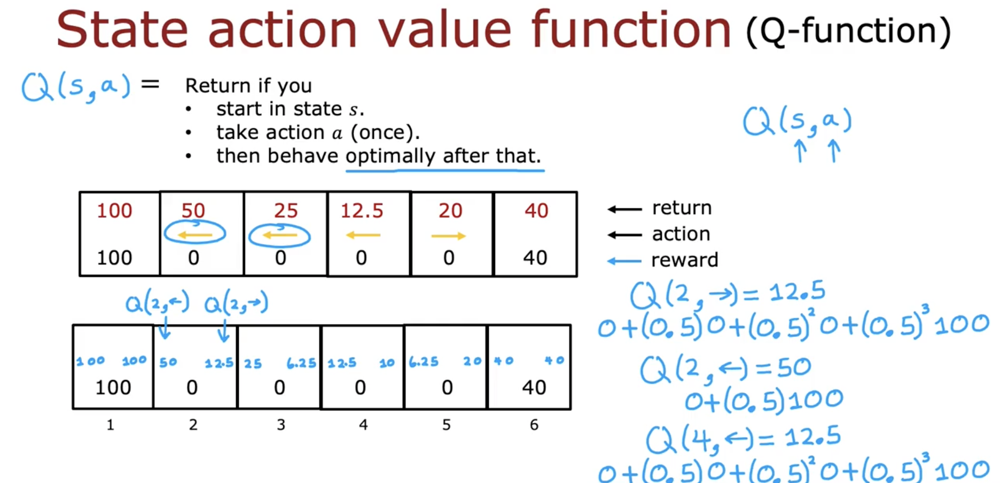

# State-action value function

### Key Concepts

- $Q(s, a)$ is the **state-action value function** or **Q-function**.
- It represents the expected return if:
  - you start in state $s$,
  - take action $a$ once,
  - then follow the **optimal policy**.

### Intuition

- Even if $Q(s, a)$ seems circular, we can compute it **without knowing the optimal policy first**.
- Once computed, it enables us to derive the **optimal action** in each state.

### Examples

- $Q(2, \rightarrow) = 12.5$
- $Q(2, \leftarrow) = 50$
- $Q(4, \leftarrow) = 12.5$
- $Q(4, \rightarrow) = 10$

### Optimal Policy Derivation

- Pick action $a$ that **maximizes** $Q(s, a)$:
  $$
  \pi(s) = \underset{a}{\text{argmax}}\ Q(s, a)
  $$

### Visuals

- Q-function explained with reward propagation:

  

- Picking best action using Q-values:

  

### Summary

- $Q(s, a)$ evaluates the action’s long-term benefit.
- Enables optimal decision-making in reinforcement learning.
- Also referred to as $Q^*(s, a)$ or **optimal Q-function**.
