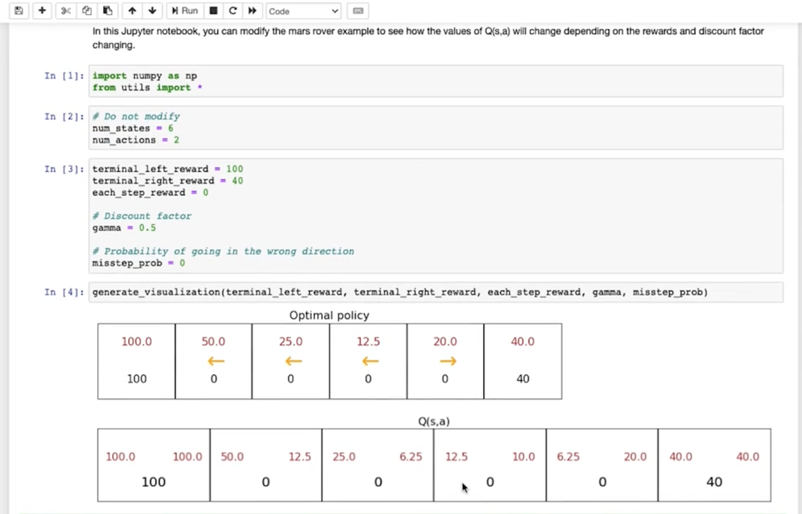
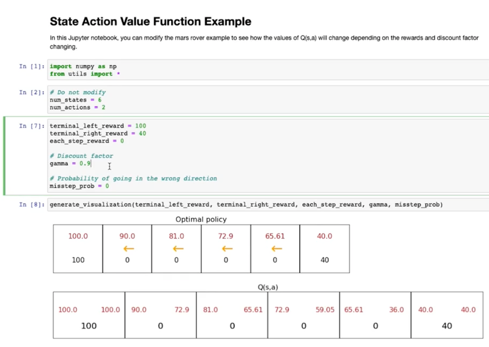
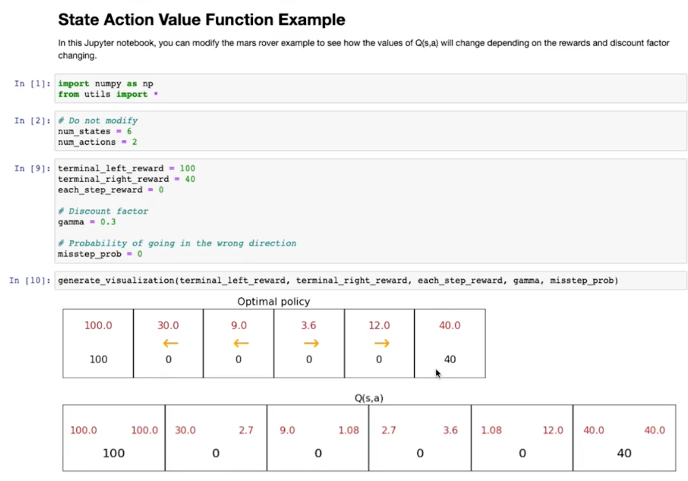

# state action value function example

This module demonstrates how the state-action value function $Q(s, a)$ varies based on terminal rewards and the discount factor $\gamma$ in a reinforcement learning setup.

## Key Concepts

- **State-action value function $Q(s, a)$**: Expected return when taking action $a$ in state $s$ and following the optimal policy thereafter.
- **Discount factor $\gamma$**: Determines how future rewards are valued.

## Setup

- States: 6
- Actions: 2
- Terminal Rewards:
  - Left terminal: 100
  - Right terminal: 40
- Intermediate Rewards: 0
- Misstep Probability: 0

## Scenarios

### 🔸 Case 1: $\gamma = 0.5$

- Moderately values future rewards.
- Optimal policy favors left due to higher discounted return.

---

### 🔸 Case 2: $\gamma = 0.9$

- Highly values future rewards.
- Optimal policy still prefers left even from state 5 because:
  - $Q(5, \text{left}) = 65.61$
  - $Q(5, \text{right}) = 36.0$
- Future rewards are discounted less heavily.

---

### 🔸 Case 3: $\gamma = 0.3$

- Very impatient; strongly discounts future rewards.
- Chooses closer reward (right terminal) from state 4 despite being smaller.

---

## Takeaways

- **Higher $\gamma$**: Future rewards are valued more → agent prefers longer paths for bigger rewards.
- **Lower $\gamma$**: Agent becomes short-sighted and prefers closer, even if smaller, rewards.
- **Optimal policy** shifts as $\gamma$ and rewards change.

