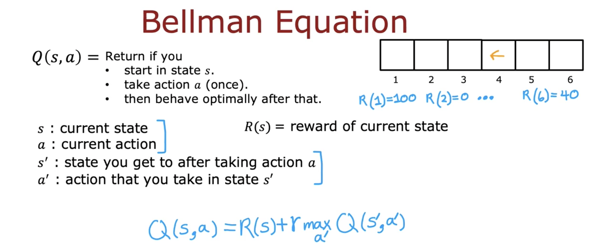
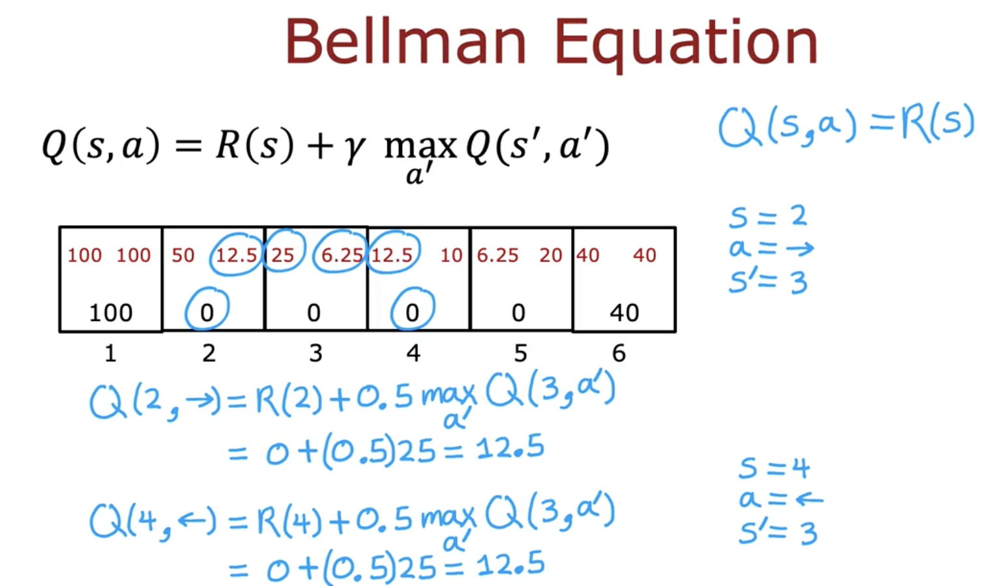
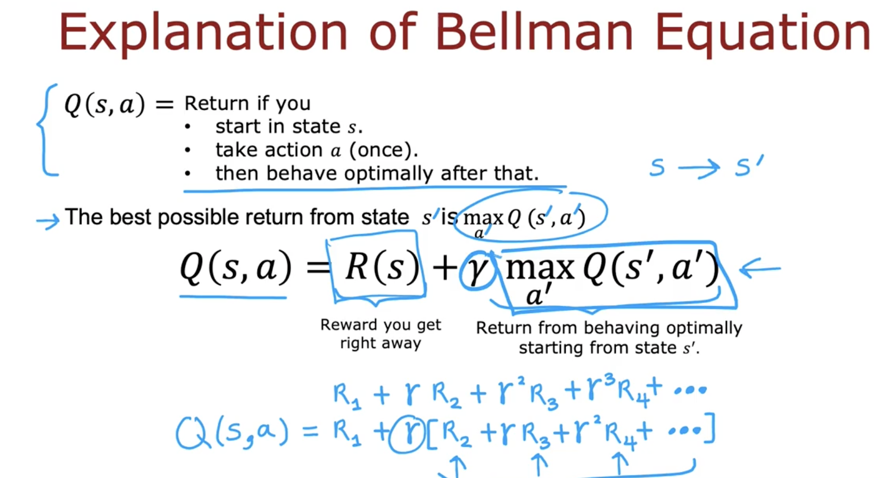
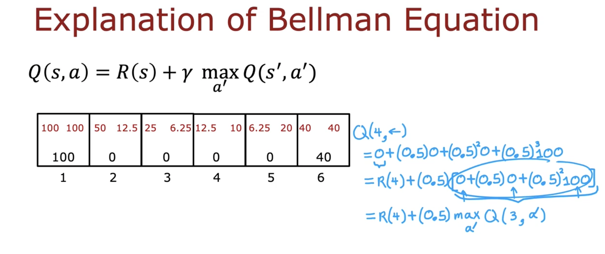

# Bellman equation

### 🔁 Summary

- $Q(s,a)$ = Return if you:
  - Start in state $s$
  - Take action $a$ once
  - Then behave optimally afterward

- **Bellman Equation**:
  $$
  Q(s, a) = R(s) + \gamma \max_{a'} Q(s', a')
  $$
  - $R(s)$: Immediate reward at state $s$
  - $\gamma$: Discount factor
  - $\max_{a'} Q(s', a')$: Best possible return from next state

### 📘 Notation
- $s$: current state
- $a$: action at $s$
- $s'$: new state after action
- $a'$: possible actions in $s'$
- $R(s)$: reward at $s$

### 🧠 Intuition

- Bellman equation breaks return into:
  - **Immediate reward**: $R(s)$
  - **Future return**: $\gamma$ × optimal return from $s'$

- Total reward:
  $$
  Q(s,a) = R_1 + \gamma R_2 + \gamma^2 R_3 + \dots
  $$

  Or,
  $$
  Q(s,a) = R(s) + \gamma \max_{a'} Q(s', a')
  $$

### 🧮 Examples

**1. $Q(2, \rightarrow)$**
- $s = 2$, $a = \rightarrow$, $s' = 3$
- $$
  Q(2, \rightarrow) = 0 + 0.5 \times \max(25, 6.25) = 12.5
  $$

**2. $Q(4, \leftarrow)$**
- $s = 4$, $a = \leftarrow$, $s' = 3$
- $$
  Q(4, \leftarrow) = 0 + 0.5 \times \max(25, 6.25) = 12.5
  $$

### 🧾 Terminal States
- In terminal states: no next state
- Equation simplifies:
  $$
  Q(s, a) = R(s)
  $$

### ✅ Key Takeaway
> Bellman equation = Immediate reward + Discounted best future return
