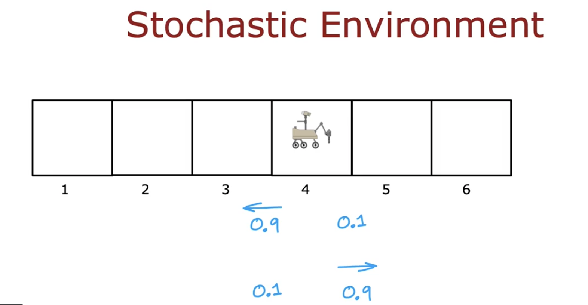
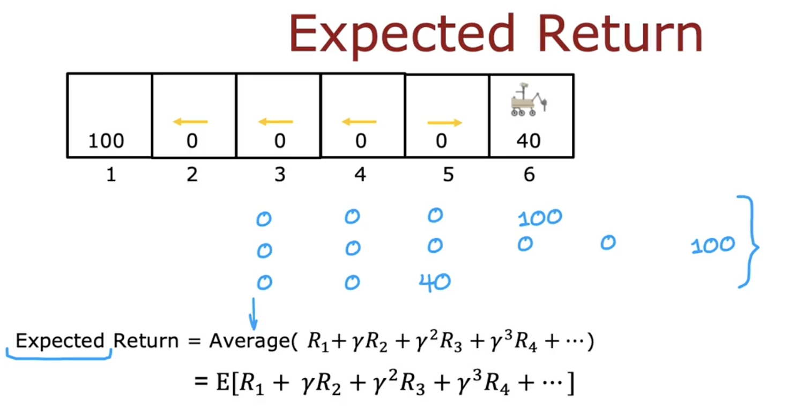
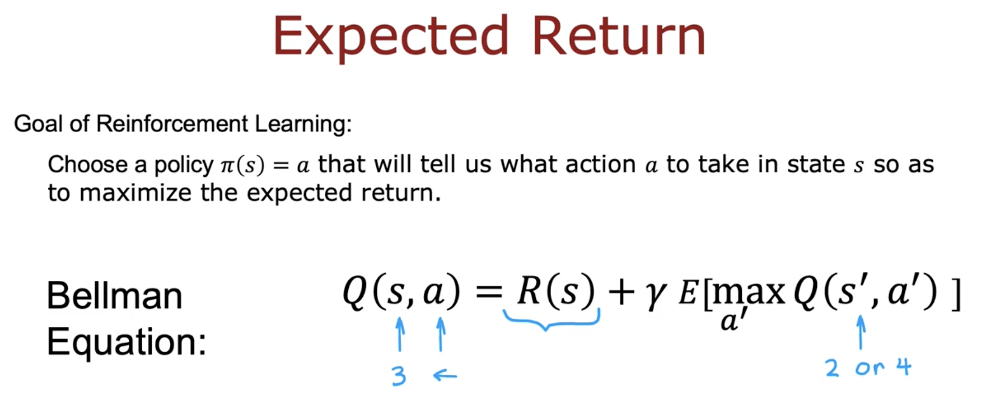

# Random (stochastic) environment

In some applications, when you take an action, the outcome is not always completely reliable. For example, if you command your Mars rover to go left, maybe there's a little bit of a rock slide or maybe the floor is really slippery and so it slips and goes in the wrong direction.

In practice, many robots don't always manage to do exactly what you tell them because of wind blowing off course, wheel slipping, or some other uncertainty. There’s a generalization of the reinforcement learning framework we've talked about so far, which models **random or stochastic environments**.

In this optional module, we'll explore how these reinforcement learning problems work using the Mars Rover example again.

Let’s say you command the rover to go left:
- **90% chance** it correctly goes left
- **10% chance** it slips and ends up going right

So, it has a 90% chance of ending up in **state 3**, and 10% chance of ending up in **state 5**.

Conversely, if you command it to go **right**:
- 90% chance of ending in state 5
- 10% chance of ending in state 3

This setup represents a **stochastic environment**.

Let’s say your **policy** is to:
- Go left in states 2, 3, 4
- Go right in state 5

If you **start in state 4** and follow this policy:
- You may be lucky and get to state 3, then to state 2, and then to the final state
- In this case, the **reward sequence** could be `0 0 0 1 0 0`

Try the **same policy again** and you may:
- Slip and return back to state 4
- Eventually reach the reward state, but through a longer path
- Reward sequence might be something like `0 0 0 0 1 0 0`

Or maybe:
- You slip immediately from state 4 and land in state 5
- From state 5, you go to state 6
- Reward sequence would be `0 0 4 0`

Since the environment is stochastic:
- You **don’t get one fixed reward sequence**
- Instead, you get **many possible reward sequences** across multiple trials

This makes the **return** (sum of discounted rewards) **a random variable**.

Thus, the goal becomes:
- **Not maximizing the return** (since it’s random)
- But **maximizing the expected return**: the average of returns over many trials

This is written using expected value notation:
$$
\mathbb{E}[R_1 + \gamma R_2 + \gamma^2 R_3 + \ldots]
$$

The job of a reinforcement learning algorithm is to:
- Choose a policy \( \pi \)
- Maximize the **expected sum of discounted rewards**

In other words:
- Pick an action in each state to maximize **expected return**

In the **Bellman equation**, the update changes slightly:
- The **next state \( s' \)** is now a **random variable**
- So we take an **expectation over the possible next states**

This gives the **Bellman equation** for stochastic environments:
$$
Q^\ast(s, a) = R(s, a) + \gamma \mathbb{E}_{s'}[\max_{a'} Q^\ast(s', a')]
$$

You can explore this visually in the optional lab:
- Set `misstep_prob = 0.1` to model 10% failure to follow command
- Observe how **optimal return** and **Q-values** reduce slightly

If you increase misstep probability to 0.4 (only 60% of actions succeed):
- Q-values and expected returns **drop even more**
- The agent has less control

Try changing this misstep value in the lab to see its effect on the Q-values and expected return.

Finally, everything we've seen so far has used a Mars Rover with just 6 states. But real-world problems often involve:
- **Much larger state spaces**
- Even **continuous** state spaces

In the next module, we’ll look at how to extend reinforcement learning to these more complex, real-world scenarios.
