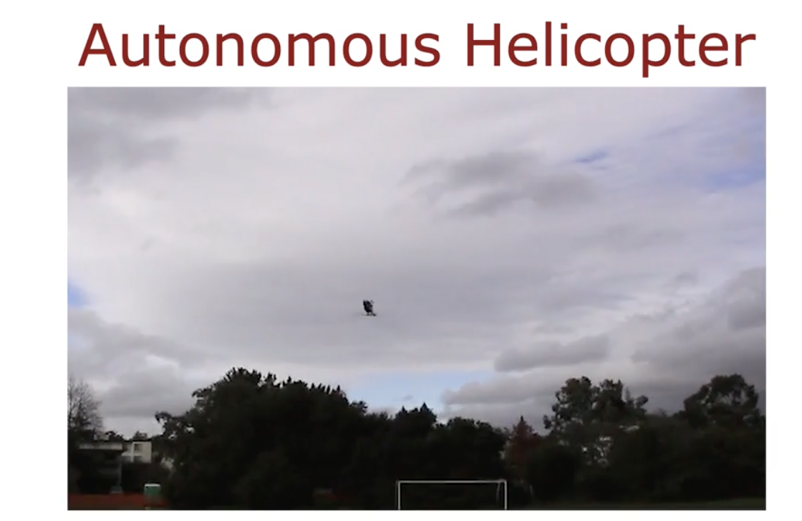
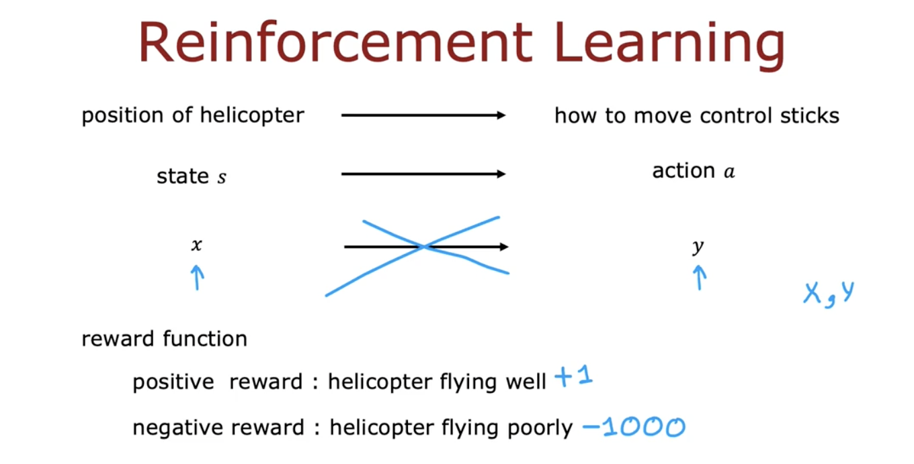

# What is Reinforcement Learning?

Welcome to this final week of the machine learning specialization. It's a little bit bittersweet for me that we're approaching the end of this specialization, but I'm looking forward to this week, sharing with you some exciting ideas about **reinforcement learning**.

In machine learning, reinforcement learning is one of those ideas that while not very widely applied in commercial applications yet today, is one of the **pillars of machine learning**. And has lots of exciting research backing it up and improving it every single day.

Let's start by taking a look at what is reinforcement learning. Let's start with an example.

Here's a picture of an autonomous helicopter.

This is actually the **Stanford autonomous helicopter**, weighs 32 pounds and it's actually sitting in my office right now. Like many other autonomous helicopters, it's instrumented with an onboard computer, GPS, accelerometers, and gyroscopes and the magnetic compass so it knows where it is at all times quite accurately.

If I were to give you the keys to this helicopter and ask you to write a program to fly it, how would you do so? Radio controlled helicopters are controlled with joysticks like these and so the task is ten times per second you're given the position and orientation and speed and so on of the helicopter. And you have to decide how to move these two control sticks in order to keep the helicopter balanced in the air.

By the way, I've flown radio controlled helicopters as well as quad rotor drones myself. And radio controlled helicopters are actually quite a bit harder to fly, quite a bit harder to keep balanced in the air.

So how do you write a program to do this automatically?

Let me show you a fun video of something we got a Stanford autonomous helicopter to do. Here's a video of it flying under the control of a reinforcement learning algorithm.

I was actually the cameraman that day and this is the helicopter flying on the computer control and if I zoom out the video, you see the trees planted in the sky. So using reinforcement learning, we actually got this helicopter to **learn to fly upside down**. We told it to fly upside down. 

Reinforcement learning has been used to get helicopters to fly a wide range of stunts or we call them **aerobatic maneuvers**.

So how do you get a helicopter to fly itself using reinforcement learning?

The task is given the position of the helicopter to decide how to move the control sticks.

In reinforcement learning, we call the position and orientation and speed and so on of the helicopter the **state** $s$. And so the task is to find a function that maps from the state of the helicopter to an **action** $a$, meaning how far to push the two control sticks in order to keep the helicopter balanced in the air and flying and without crashing.

One way you could attempt this problem is to use **supervised learning**. It turns out this is not a great approach for autonomous helicopter flying.

But you could say, well if we could get a bunch of observations of states and maybe have an expert human pilot tell us what's the best action $y$ to take. You could then train a neural network using supervised learning to directly learn the mapping from the states $s$ (which I'm calling $x$ here), to an action $a$ (which I'm calling the label $y$ here).

But it turns out that when the helicopter is moving through the air is actually very ambiguous, what is the exact one right action to take. Do you tilt a bit to the left or a lot more to the left or increase the helicopter stress a little bit or a lot? It's actually very difficult to get a data set of $x$ and the ideal action $y$.

That's why for a lot of tasks of controlling a robot like a helicopter and other robots, the supervised learning approach doesn't work well and we instead use **reinforcement learning**.

A key input to a reinforcement learning is something called the **reward** or the **reward function** which tells the helicopter when it's doing well and when it's doing poorly.

The way I like to think of the reward function is a bit like **training a dog**. When I was growing up, my family had a dog and it was my job to train the dog or the puppy to behave.

So how do you get a puppy to behave well? Well, you can't demonstrate that much to the puppy. Instead you let it do its thing and whenever it does something good, you go, *good dog*. And whenever they did something bad, you go, *bad dog*. And then hopefully it learns by itself how to do more of the good dog and fewer of the bad dog things.

Training with the reinforcement learning algorithm is like that. When the helicopter's flying well, you go, *good helicopter* and if it does something bad like crash, you go, *bad helicopter*. And then it's the reinforcement learning algorithm's job to figure out how to get more of the good helicopter and fewer of the bad helicopter outcomes.

One way to think of why reinforcement learning is so powerful is you have to tell it **what to do** rather than **how to do it**. And specifying the reward function rather than the optimal action gives you a lot more flexibility in how you design the system.

Concretely for flying the helicopter, whenever it is flying well, you may give it a reward of **plus one** every second it is flying well. And maybe whenever it's flying poorly you may give it a **negative reward** or if it ever crashes, you may give it a very large negative reward like **negative 1,000**. And so this would incentivize the helicopter to spend a lot more time flying well and hopefully to never crash.

But here's another fun video. I was using the good dog bad dog analogy for reinforcement learning for many years. And then one day I actually managed to get my hands on a **robotic dog** and could actually use this reinforcement learning good dog bad dog methodology to train a robot dog to get over obstacles.

This is a video of a robot dog that using reinforcement learning, which rewards it, moving toward the left of the screen has learned how to place its feet carefully or climb over a variety of obstacles.

And if you think about what it takes to program a dog like this, I have no idea, I really don't know how to tell it what's the best way to place its legs to get over a given obstacle. All of these things were figured out automatically by the robot just by giving it rewards that incentivizes it, making progress toward the goal on the left of the screen.

Today, reinforcement learning has been successfully applied to a variety of **applications** ranging from controlling robots. And in fact later this week in the practice lab, you implement for yourself a reinforcement learning algorithm to land a **lunar lander** in simulation.

It's also been used for **factory optimization**. How do you rearrange things in the factory to maximize throughput and efficiency as well as **financial stock trading**. For example, one of my friends was working on efficient stock execution. So if you decided to sell a million shares over the next several days, well, you may not want to dump a million shares on the stock market suddenly because that will move prices against you. So what's the best way to sequence out your trades over time so that you c...

Finally, there have also been many applications of reinforcement learning to **playing games**, everything from checkers to chess to the card game of bridge to go as well as for playing many video games.

So that's reinforcement learning. Even though reinforcement learning is not used nearly as much as supervised learning, it is still used in a few applications today. 

The key idea is rather than you needing to tell the algorithm what is the right output $y$ for every single input, all you have to do instead is specify a reward function that tells it when it's doing well and when it's doing poorly. And it's the job of the algorithm to automatically figure out how to choose good actions.

With that, let's now go into the next video where we'll formalize the reinforcement learning problem and also start to develop algorithms for automatically picking good actions.
