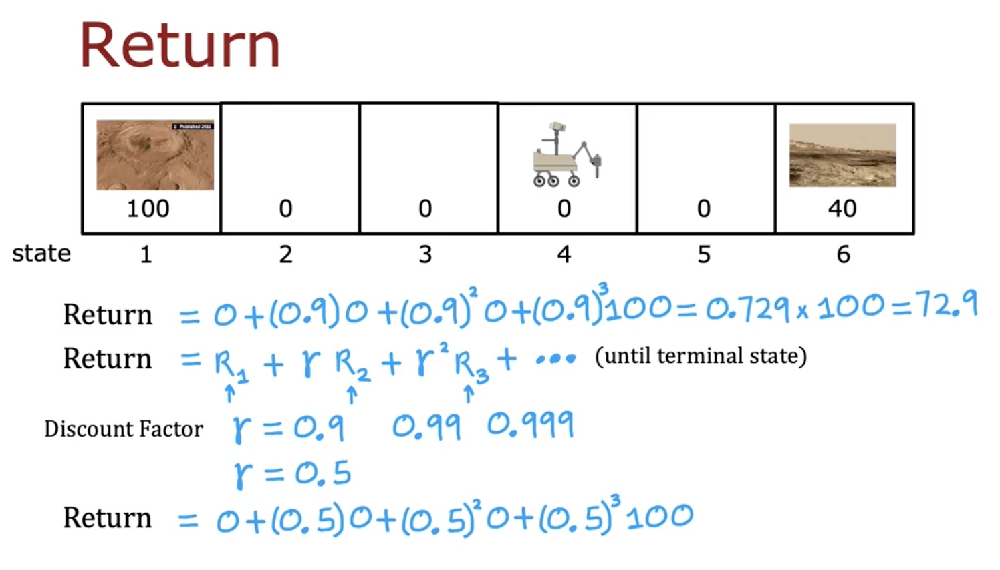
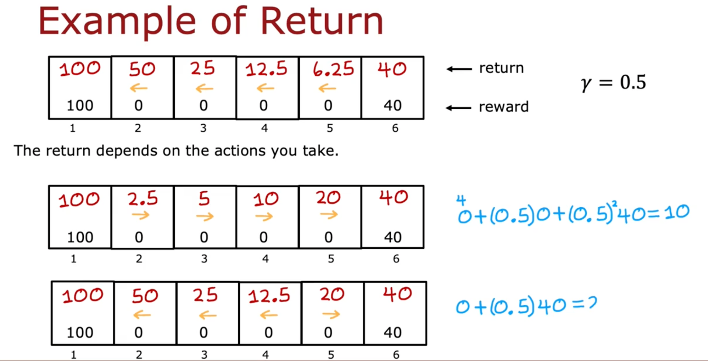

# The return in reinforcement learning

In this module, we explore the critical concept of **return** in reinforcement learning. Understanding this helps us evaluate different sets of rewards to decide the best actions to take.

## Defining Return

The return in reinforcement learning refers to the total sum of rewards that an agent receives, weighted by a **discount factor**. This discount factor emphasizes the idea that rewards received sooner are generally more valuable than rewards received later.

Imagine choosing between picking up a five-dollar bill at your feet or walking half an hour for a ten-dollar bill. Even though the latter is worth more, the immediate five dollars might be preferable due to convenience. The **return** captures precisely this preference.

## Mars Rover Example

In our Mars Rover scenario, suppose the rover starts from state 4 and moves left towards state 1, receiving a reward of 100 at the terminal state (state 1), with no intermediate rewards.

If the discount factor (γ) is 0.9, the return calculation is:

\[ 	ext{Return} = 0 + 0.9 \times 0 + 0.9^2 \times 0 + 0.9^3 \times 100 = 72.9 \]

## Example Returns (Moving Left)

Here's the return calculation visual when always moving left:

## Example Returns (Moving Right)

Now consider always moving right. The returns for this scenario are significantly different:

## Importance of the Discount Factor (γ)

The discount factor γ, typically close to 1 (e.g., 0.9, 0.99), makes the algorithm slightly impatient by giving less importance to future rewards. Lower values of γ (e.g., 0.5) greatly reduce the perceived value of future rewards.

## Financial Analogy

In financial contexts, γ corresponds to the concept of interest rates or the time value of money, where money today is generally valued more than money tomorrow due to potential interest accumulation.

## Negative Rewards

In cases of negative rewards, the discount factor incentivizes delaying negative outcomes as far into the future as possible.

## Summary

The return in reinforcement learning helps us evaluate and optimize the actions taken by an agent, emphasizing the greater value of immediate rewards over delayed ones. Understanding this concept is fundamental to designing effective reinforcement learning algorithms.
