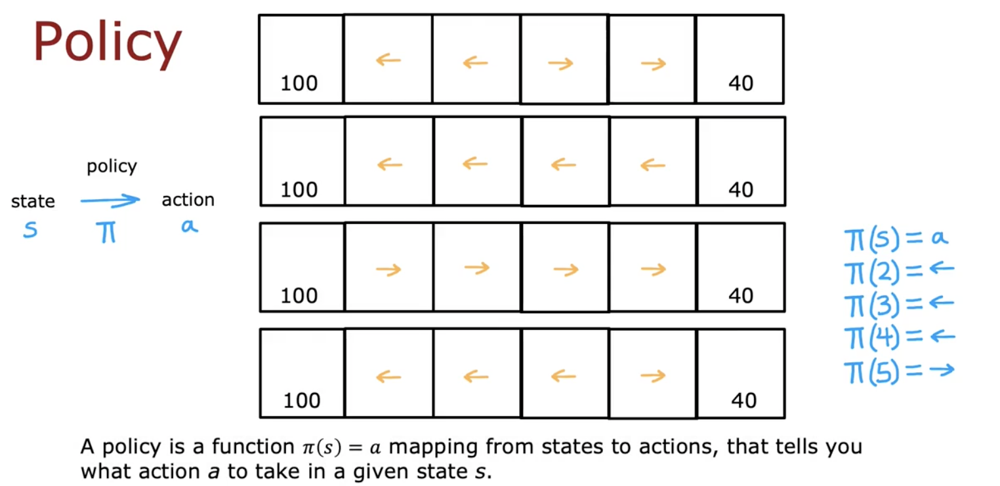
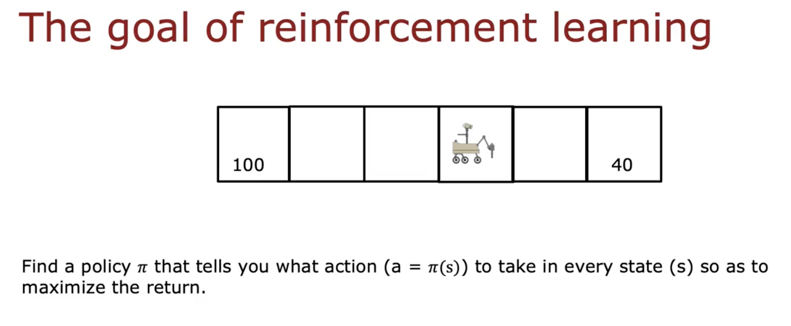

# Making Decisions: Policies in Reinforcement Learning

## Key Concepts:

- **Policy (\(\pi\))**: A function mapping states to actions.
  - \[\pi(s) = a\]
  - Guides the agent’s decision-making process in reinforcement learning (RL).

- **Different Policy Examples:**
  - Always choose the nearest reward.
  - Always choose the larger reward.
  - Always choose the smaller reward (less optimal).
  - Conditional actions based on proximity to rewards.

## Reinforcement Learning Objective:
- Find a policy \(\pi\) to determine optimal actions from each state.
- Objective: Maximize cumulative returns (long-term rewards).

## Notes:
- "Policy" is standard terminology in RL, though "controller" might be more intuitive.