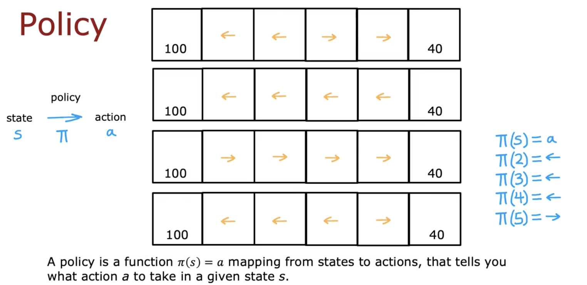
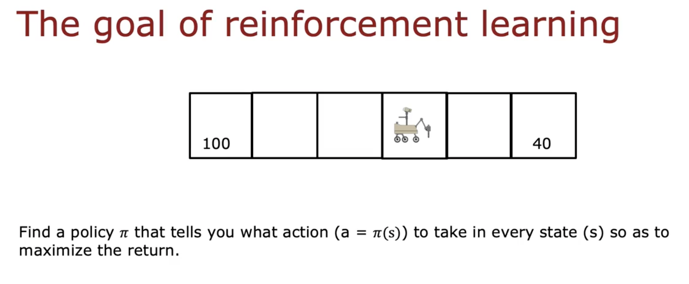

# Making Decisions: Policies in Reinforcement Learning

In this module, we delve into the concept of **policies** within the context of reinforcement learning (RL). A policy is central to the decision-making process in RL, as it defines how actions are selected based on the current state of the system.

## Understanding Policies

In reinforcement learning, there are various strategies to decide actions. For instance, one straightforward approach is to always aim for the nearest reward. This means choosing to move left if the reward to the left is closer or moving right if the reward on the right is nearer. Alternatively, one might consistently choose the larger reward or even the smaller one—though the latter doesn't typically yield optimal outcomes.

Another nuanced strategy could involve always moving left unless you are exactly one step away from a smaller reward, in which case you choose that instead. Each of these strategies represents a different potential policy.

Formally, a policy is denoted by the symbol $\pi$. This policy function, $\pi(s)$, maps a given state $s$ to a corresponding action $a$:

\[
\pi(s) = a
\]

This means that for every state encountered by the agent, the policy provides an action to take.

For example, consider a policy illustrated by the following rules:

- In state $2$, go left.
- In state $3$, go left.
- In state $4$, go left.
- In state $5$, go right.

Such a policy explicitly dictates the optimal action for each state encountered by the agent.

## Goal of Reinforcement Learning

The main objective in reinforcement learning is to determine the optimal policy that maximizes the expected return or cumulative reward over time. Specifically, the task is to find a policy $\pi$ that tells you exactly what action ($a = \pi(s)$) to perform in every possible state ($s$) to achieve the best long-term outcome.

The term "policy" might seem somewhat abstract or not entirely descriptive initially. A term like "controller" might intuitively resonate more as it directly suggests a mechanism of decision-making control. However, the term "policy" is the established norm in reinforcement learning literature and practice.

## Summary and Next Steps

This module introduced a core concept in reinforcement learning—the policy. It explained how different policies guide action selection and highlighted the primary objective of RL: discovering the policy that maximizes rewards.

In the subsequent modules, we will explore algorithms specifically designed to find these optimal policies.