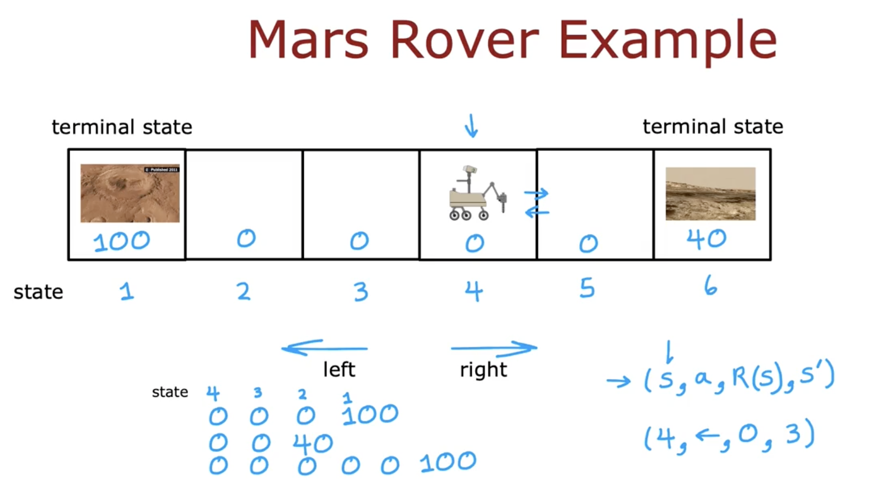

# Mars Rover Example - revision

- Simplified Mars rover example for reinforcement learning.
- Rover can be in one of **6 states**:
  - **State 1**: Reward = 100 (most interesting science site, terminal)
  - **State 2-5**: Reward = 0
  - **State 6**: Reward = 40 (interesting but less than state 1, terminal)

- **Actions**:
  - Move **left**
  - Move **right**

- **Terminal States**:
  - State 1 and State 6 end the episode (no more actions after reaching them).

- **State Transition Example**:
  - From **state 4**, moving **left** leads to 3 → 2 → 1 with reward 0, 0, 100.
  - From **state 4**, moving **right** leads to 5 → 6 with reward 0, 40.

- **Core Reinforcement Learning Elements**:
  - **State (S)**
  - **Action (a)**
  - **Reward (R(S))**
  - **Next state (S')**

- Example: (S=4, a=left, R(S)=0, S'=3)

- Rewards are associated with the **current state**, not the next.

---

### Visual:

---

- This setup helps define how a reinforcement learning agent evaluates actions.
- **Next topic**: understanding the **return** in reinforcement learning.
