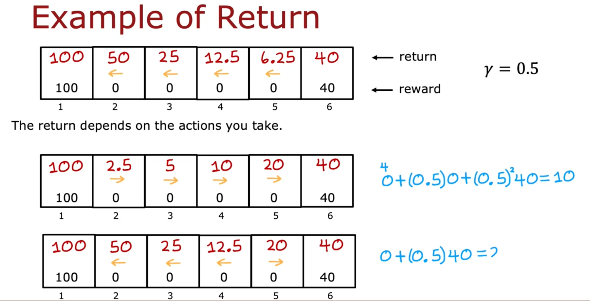

# The return in reinforcement learning - revision

## Key Concepts
- **Return**: Discounted sum of future rewards.
- **Discount Factor (γ)**: Number between 0 and 1; typically close to 1.

## Return Calculation
General formula:

\[ 	ext{Return} = R_1 + \gamma R_2 + \gamma^2 R_3 + \dots \]

## Mars Rover Example
- Moving left, reward at state 1: 100.
- γ = 0.9, Return = 72.9.

## Visual Examples
### Always Left

### Always Right

## Discount Factor Importance
- Closer to 1: future rewards are nearly as valuable as immediate rewards.
- Lower γ heavily discounts future rewards.

## Financial Interpretation
- Immediate rewards more valuable due to interest accumulation potential.

## Negative Rewards
- Negative rewards incentivized to be delayed by discounting.

## Summary
- Return evaluates long-term action benefits.
- Prefers immediate rewards for efficiency.
