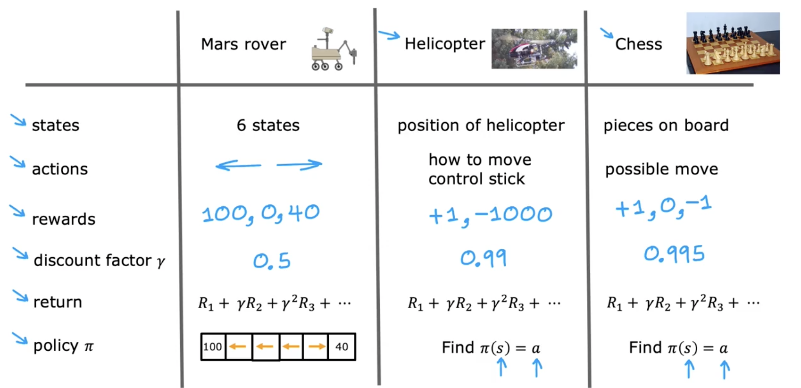

---
title: 5. Review of key concepts - revision
tags: [revision]
publish: false
---

# Review of key concepts - revision

### Key Terms
- **States**: Conditions/positions of agent.
- **Actions**: Choices available to agent.
- **Rewards**: Numeric feedback.
- **Discount Factor (\(\gamma\))**: Importance of future rewards.
- **Return**: \(R_1 + \gamma R_2 + \gamma^2 R_3 + \dots\)
- **Policy (\(\pi\))**: Action selection strategy.

### Examples:
- **Mars Rover**
  - States: 6 states
  - Actions: Left/right
  - Rewards: 100, 0, 40
  - Discount: 0.5

  

- **Helicopter**
  - States: Position, orientation, speed
  - Actions: Control stick movements
  - Rewards: +1, -1000
  - Discount: 0.99

- **Chess**
  - States: Chess positions
  - Actions: Legal moves
  - Rewards: +1 (win), 0 (tie), -1 (loss)
  - Discount: 0.995

### Markov Decision Process (MDP)
- Future state depends only on current state (Markov property).
- Agent selects actions (\(\pi\)), observes new states/rewards.

