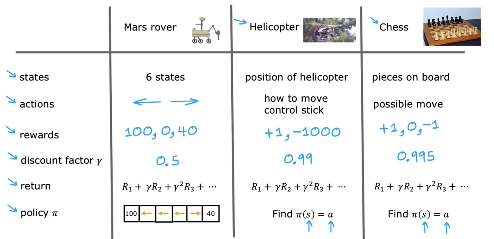
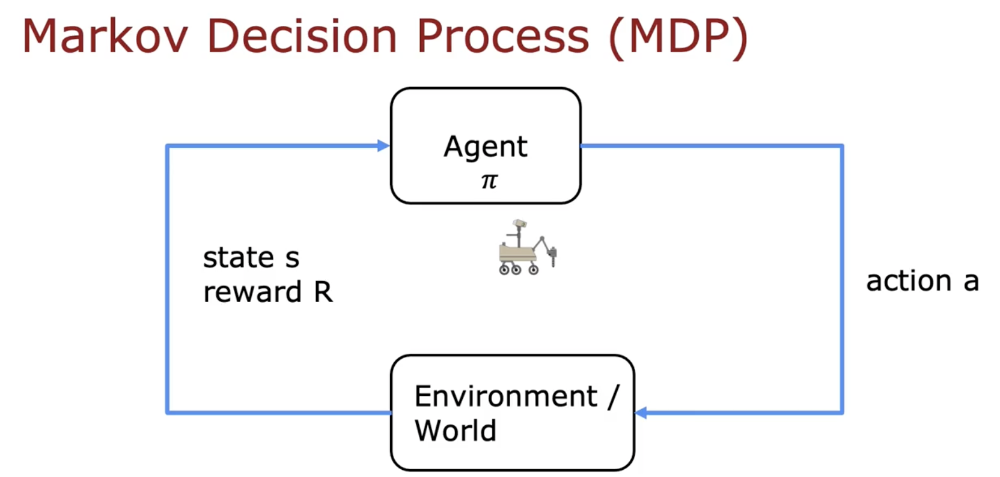

---
title: 5. Review of key concepts
tags: [blog]
publish: true
---

# Review of key concepts

In this module, we've developed a reinforcement learning formalism using the six-state Mars rover example. Let's quickly review the key concepts and see how these apply to other applications.

Important terms defined in this module are:

- **States**: Specific conditions or positions of the agent in a reinforcement learning problem.
- **Actions**: Choices available to the agent.
- **Rewards**: Numerical feedback given to the agent based on its actions.
- **Discount Factor (\(\gamma\))**: Determines the importance of future rewards, typically a number less than one.
- **Return**: Calculated using rewards and the discount factor via the formula:
  $$
  R_1 + \gamma R_2 + \gamma^2 R_3 + \dots
  $$
- **Policy (\(\pi\))**: Strategy to select actions that maximize the return.

### Mars Rover Example
- **States**: Numbered 1-6.
- **Actions**: Move left or right.
- **Rewards**: 100 (leftmost), 40 (rightmost), and 0 (intermediate states).
- **Discount Factor**: 0.5.

### Autonomous Helicopter Example
- **States**: Positions, orientations, speeds.
- **Actions**: Control stick movements.
- **Rewards**: +1 (flying well), -1000 (crash).
- **Discount Factor**: 0.99.

### Chess Example
- **States**: Position of chess pieces.
- **Actions**: Legal moves.
- **Rewards**: +1 (win), 0 (tie), -1 (loss).
- **Discount Factor**: ~0.995.

This reinforcement learning formalism is known as the **Markov Decision Process (MDP)**. The Markov property indicates that future states depend only on the current state, not past states.

In an MDP:
- The agent selects an action using a policy \(\pi\).
- The action affects the environment, changing the state and producing rewards.
- The agent observes the new state and rewards.

This foundational structure prepares us to develop algorithms for selecting optimal actions, starting with defining the state-action value function, a crucial component we'll explore next.
